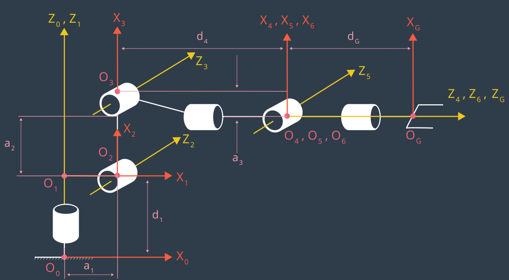
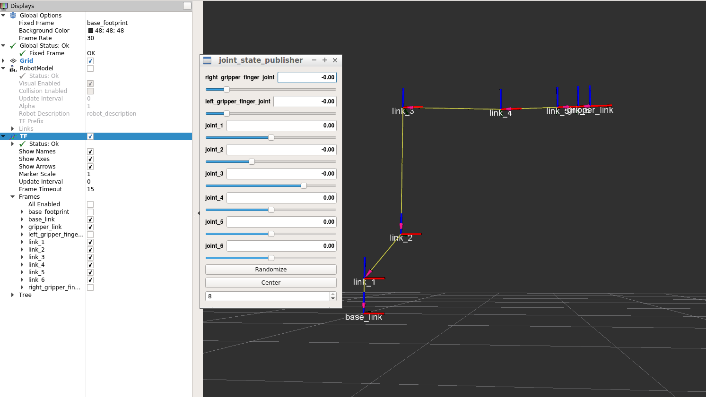
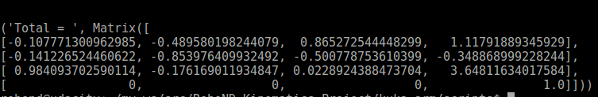
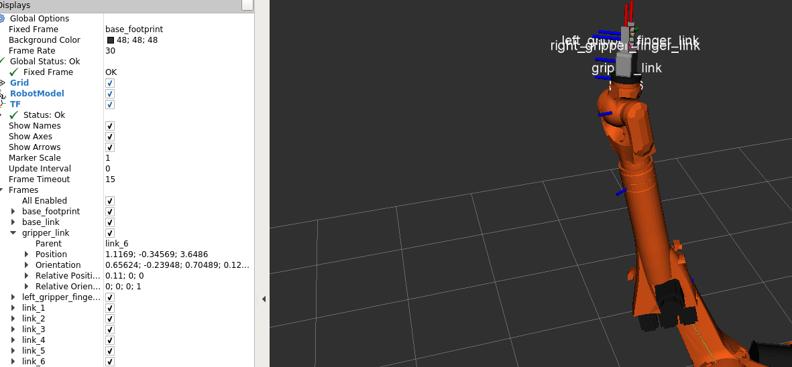
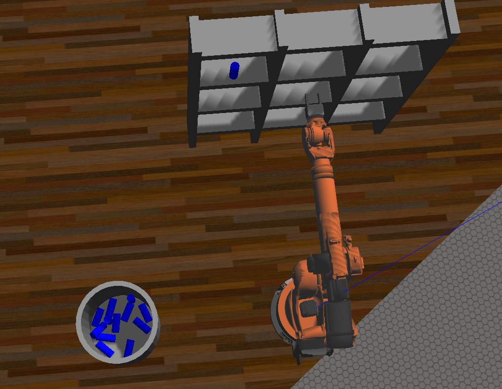

## Project: Kinematics Pick & Place

---


**Steps to complete the project:**  


1. Set up your ROS Workspace.
2. Download or clone the [project repository](https://github.com/udacity/RoboND-Kinematics-Project) into the ***src*** directory of your ROS Workspace.  
3. Experiment with the forward_kinematics environment and get familiar with the robot.
4. Launch in [demo mode](https://classroom.udacity.com/nanodegrees/nd209/parts/7b2fd2d7-e181-401e-977a-6158c77bf816/modules/8855de3f-2897-46c3-a805-628b5ecf045b/lessons/91d017b1-4493-4522-ad52-04a74a01094c/concepts/ae64bb91-e8c4-44c9-adbe-798e8f688193).
5. Perform Kinematic Analysis for the robot following the [project rubric](https://review.udacity.com/#!/rubrics/972/view).
6. Fill in the `IK_server.py` with your Inverse Kinematics code. 


## Kinematic Analysis
###  DH parameters.

To derive the DH paramereters we use the same reference frames as taught in the forward kinematic lecture and can be seen below:



When we run the forward kinematics we can see that for the initial joint states, the robot has the same cofiguration as shown below:



We use the above two figures to derive the DH parameter table using the rules taught in class:

Links | alpha(i-1) | a(i-1) | d(i-1) | theta(i)/q(i)
--- | --- | --- | --- | ---
0->1 | 0 | 0 | L1 | qi
1->2 | pi/2 | L2 | 0 | -pi/2 + q2
2->3 | 0 | L3 | 0 | q3
3->4 | -pi/2 | L4 | L5 | q4
4->5 | pi/2 | 0 | 0 | q5
5->6 | -pi/2 | 0 | 0 | q6
6->EE | 0 | 0 | L6 | 0

We also find out values of the different using the kr210.urdf.xacro file and these are lister below:
- L1 = 0.33 + 0.43 =0.75 m
- L2 = 0.35 m
- L3 = 1.25 m
- L4 = -0.054 m
- L5 = 0.96 + 0.54 = 1.5 m
- L6 =0.193 + 0.11 = 0.303 m

### Individual Transformation matrix about each joint

The following function is called to create transformation matrices about individual joints using parameters from the DH-table 

```
### Creates Homogeneous Transform Matrix from DH parameters
def homogeneous_transform(alpha,a,d,q):
    T = Matrix(
    [[cos(q),            -sin(q),           0,             a          ],
    [ sin(q)*cos(alpha), cos(q)*cos(alpha), -sin(alpha), -sin(alpha)*d],
    [ sin(q)*sin(alpha), cos(q)*sin(alpha),  cos(alpha),  cos(alpha)*d],
    [                 0,                 0,           0,             1]]
    )
   return T
   
```
   
**Homogenous Transform matrix from base_link to gripper_link using only the position and orientation of the gripper_link**


    # Create individual transformation matrices

    T0_1 = TF_Matrix(alpha0, a0, d1, q1).subs(s)
    T1_2 = TF_Matrix(alpha1, a1, d2, q2).subs(s)
    T2_3 = TF_Matrix(alpha2, a2, d3, q3).subs(s)
    T3_4 = TF_Matrix(alpha3, a3, d4, q4).subs(s)
    T4_5 = TF_Matrix(alpha4, a4, d5, q5).subs(s)
    T5_6 = TF_Matrix(alpha5, a5, d6, q6).subs(s)
    T6_EE = TF_Matrix(alpha6, a6, d7, q7).subs(s)
    
    T0_EE= T0_1*T1_2*T2_3*T3_4*T4_5*T5_6*T6_EE  #from base length to end effector```
    
However when compared with the RViz robot these transformations will result in a different gripper orientation. So we apply a rotation in Y and Z on the final transform to correct for this

The code for that can be seen below.
    
    R_y  = Matrix([[cos(p), 0, sin(p)],
           [0,      1,       0],
           [-sin(p), 0,  cos(p)]])

    R_z  = Matrix([[cos(y), -sin(y), 0],
           [sin(y),  cos(y), 0],
           [0 ,     0,       1]])
    
    
    R_correction = R_z.subs(y, pi) * R_y.subs(p, -pi/2)

    T_total= simplify(T0_EE * R_correction)
    
We check for correctness of our forward kinematics loop by running the forward_kinematics launch file and feeding the same joint values as we give to calculate T_total below:

    T_total.evalf(subs={q1:-0.26, q2:0.44, q3:-1.84, q4:-2.53, q5:0.29, q6:-0.86})

We get the following resulting matrix


and if we compare to the gripper location in Rviz it matches below:


    
## Inverse Kinematic

We know the X, Y and Z position and the roll pitch yaw of the end effector, now we need to calculate the joint angles for these positions. First the location of the wrist center is calculated
    
    R_EE = R_z * R_y * R_x   #extrinsic rotation
    WC = EE - (0.303)*R_EE[:,2]
    
With the wrist center position known we can calculate the first 3 joints angles can be calculated. 

    theta1 = atan2(WC[1],WC[0])
    
    T0_G = Rrpy
    T3_G_calc = inv(T0_3) * Rrpy


## Project Implementation

When running IK_debg we get very low errors in theta calculations. I run it for 12 cases and it succeeds in all 12 cases as shown below



## Improvement

- We can have more logic when setting the angles for joint 4 and 6 so as to prevent full circle.
- To improve the calculation time we can certainly add a class structure that stores the matrices outside the class.
